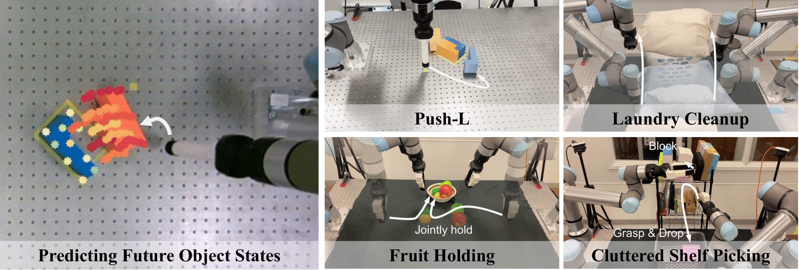

# Learning Coordinated Bimanual Manipulation Policies using State Diffusion and Inverse Dynamics Models



[Haonan Chen](http://haonan16.github.io/)<sup>1</sup>,
[Jiaming Xu](#)<sup>*1</sup>,
[Lily Sheng](#)<sup>*1</sup>,
[Tianchen Ji](https://tianchenji.github.io/)<sup>1</sup>
[Shuijing Liu](https://shuijing725.github.io/)<sup>3</sup>
[Yunzhu Li](https://yunzhuli.github.io/)<sup>2</sup>,
[Katherine Driggs-Campbell](https://krdc.web.illinois.edu/)<sup>1</sup>

<sup>1</sup>University of Illinois, Urbana-Champaign,
<sup>2</sup>Columbia University,
<sup>3</sup>The University of Texas at Austin


### Environment Setup

We recommend using [Mambaforge](https://gyithub.com/conda-forge/miniforge#mambaforge) over the standard Anaconda distribution for a faster installation process. Create your environment using:

1. Install the necessary dependencies:
    ```console
    sudo apt install -y libosmesa6-dev libgl1-mesa-glx libglfw3 patchelf libglm-dev
    ```

2. Clone the repository:
    ```console
    git clone --recursive https://github.com/haonan16/coord_bimanual/
    cd coord_bimanual/
    ```

3. Update `mamba`, and create and activate the environment:

    To update `mamba` and create the environment, use the following commands:

    ```console
    mamba install mamba=1.5.1 -n base -c conda-forge
    mamba env create -f conda_environment.yml
    mamba activate coord_bimanual
    ```


## Data Preparation

```console
mkdir -p data
```

Place the `pushl` dataset in the `data` folder. The directory structure should be:

To obtain the dataset, download the corresponding zip file and unzip it from the following link:  

- [PushL Dataset](https://drive.google.com/file/d/1433HHxOH5nomDZ12aUZ4XZel4nVO_uwL/view?usp=sharing)

For datasets from other simulation benchmarks, you can find them here:  

- [Simulation Benchmark Datasets from Diffusion Policy](https://github.com/real-stanford/diffusion_policy?tab=readme-ov-file)


Once downloaded, extract the contents into the `data` folder.

Directory structure:

```
data/
└── pushl_dataset/
```


## Demo, Training and Eval


Activate conda environment and login to [wandb](https://wandb.ai) (if you haven't already).
```console
conda activate coord_bimanual
wandb login
```


### Collecting Human Demonstration Data 

Run the following script to collect human demonstration:

```console
python demo_push_data_collection.py
```

The agent agent position can be controlled by the mouse. The following keys can be used to control the environment:
- `Space` - Pause and step forward (increments `plan_idx`)
- `R` - Retry current attempt
- `Q` - Exit the script


### Training
To launch training, run:


```console
python train.py \
  --config-name=train_diffusion_trajectory_unet_lowdim_workspace.yaml 
```


## Acknowledgement
* Policy training implementation is adapted from [Diffusion Policy](https://github.com/real-stanford/diffusion_policy/tree/main).
